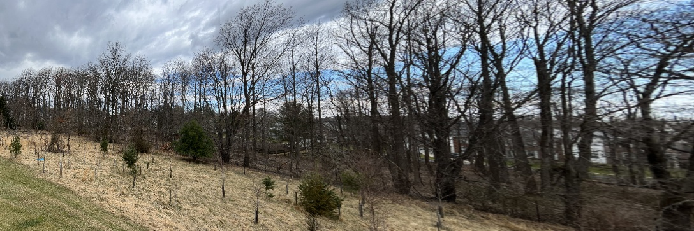

# Panorama
Stitching the images to create the panoramic.

## Problem Statement
You are given four images which were taken from the same camera position (only rotation no translation) you will need to stitch these images to create a panoramic image.

## Steps to run the code:

1. Download the folder as zip and extract it or git clone "https://github.com/RohitReddy16/Panaroma"
2. Open "Panoromic.py" and run it 
    Libraries used:
        1. OpenCV; import cv2
        2. Numpy; import numpy

## Description 

The code is using OpenCV library in Python to stitch multiple images into a single panorama image. The images are first resized to a smaller scale and stored in a list.

The code defines two functions. The first function match_points_knn_flann takes two images as input, converts them to grayscale, applies SIFT feature detection and description on them, and matches the features using the FLANN matcher. It returns an image showing the matches.

The second function panaroma also takes two images as input, detects and describes SIFT features, matches them using FLANN matcher, and applies RANSAC algorithm to find the best Homography matrix that transforms one image to another. It then uses the Homography matrix to warp the second image onto the first image and stitches them together to form a panorama image.

Lastly, the code iterates over the list of resized images, applies match_points_knn_flann function on each pair of consecutive images, and displays the resulting images showing the matched features.

## RESULT
Panaromic image: 

